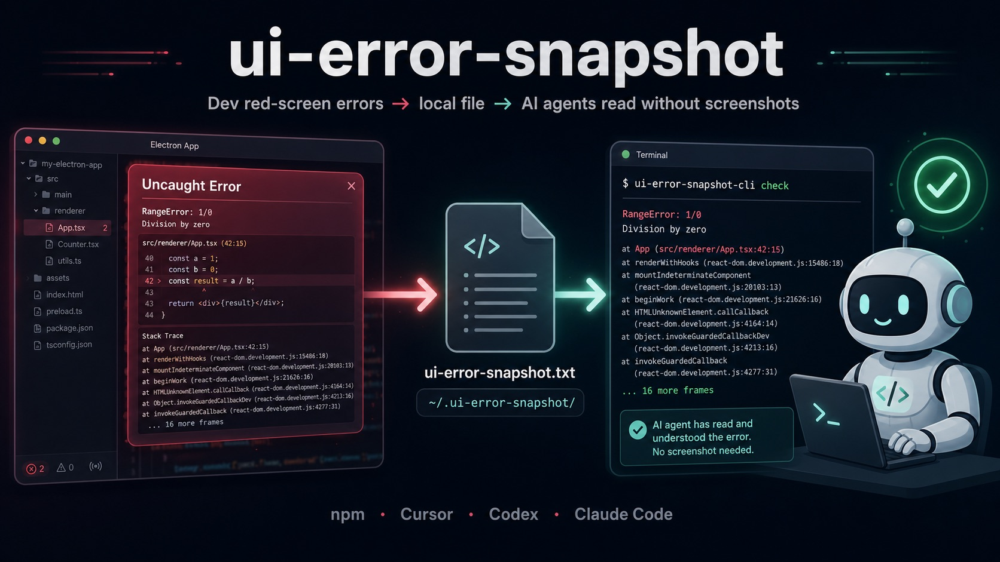
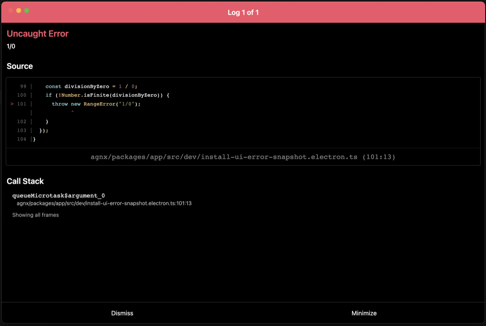
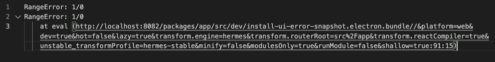

# ui-error-snapshot



> Dev UI crash snapshots that AI coding agents can read — no screenshots required.

When your dev app hits a red screen, agents usually guess from screenshots or stale logs. **ui-error-snapshot** captures uncaught renderer errors into a single local file with a stable contract. Any agent loop (Cursor, Codex CLI, Claude Code, OpenCode, CI) can `check` before claiming success.

**中文文档：** [README.zh-CN.md](./README.zh-CN.md)

---

## For users: copy this one sentence to your AI

**No need to clone this repo or understand npm.** Copy the paragraph below into Cursor / Codex / Claude Code / any agent:

> Open and fully follow https://github.com/duo121/ui-error-snapshot/blob/main/docs/COPY_FOR_AGENT.en.md (or the Chinese prompt at docs/复制给Agent.zh-CN.md) to integrate ui-error-snapshot into the current project: capture dev uncaught UI errors to `~/.ui-error-snapshot/ui-error-snapshot.txt` for later CLI checks; do not clone the ui-error-snapshot repo or run a separate daemon; finish with probe and check and report which files you changed.

The agent will: `npm install` → wire hooks → add check scripts → add agent rules.

Full prompts: [docs/COPY_FOR_AGENT.en.md](./docs/COPY_FOR_AGENT.en.md) · [docs/复制给Agent.zh-CN.md](./docs/复制给Agent.zh-CN.md)

---

## At a glance: what problem does this solve?

| Before | With ui-error-snapshot |
|--------|------------------------|
| Red screen → screenshot or describe to the agent | Errors **auto-written** to `~/.ui-error-snapshot/ui-error-snapshot.txt` |
| Agent guesses from stale logs | Agent runs `check` and **reads the stack** |
| Manual handoff every time | Integrate once; **every agent loop** can verify |

### ① Dev red screen (Electron · RN Web · Vite …)



### ② Agent reads the same error via CLI (no screenshot)

After hooks write the crash to disk, any agent loop can run:

```bash
npx @duo121/ui-error-snapshot-cli check   # non-empty → exit 1 + stack on stderr
```



> Real Electron dev screenshots. Same flow in your project after integration.

**Hero image prompt (GPT Image 2):** [docs/HERO_IMAGE_PROMPT.zh-CN.md](./docs/HERO_IMAGE_PROMPT.zh-CN.md)

---

## Do I need to run a separate project?

**No.** There is no daemon, no second dev server, and nothing to keep running in the background.

| Mode | Change to your app | When |
|------|-------------------|------|
| **A. devDependency (default)** | ~5 lines in entry, 1 npm script, 1 agent rule | npm-based frontends |
| **B. Single-file script** | Copy `scripts/standalone-browser.mjs`, no npm packages | Minimal / no new deps |
| **C. Agent rule only** | Zero code if you already write a crash file | Unify contract only |

**Not recommended:** cloning this repo into the user project or running ui-error-snapshot as a standalone service.

## Architecture

```
┌──────────────────────────────────────────────────────────────┐
│                     Dev Host Application                      │
│  Electron · RN Web · Vite · Next · Expo …                     │
├──────────────────────────────────────────────────────────────┤
│  Hook Layer (@ui-error-snapshot/hook-browser)                 │
│  ├─ window.error / unhandledrejection                           │
│  ├─ ErrorUtils.setGlobalHandler (RN, optional)                  │
│  └─ window.__uiErrorSnapshotProbe() (dev verification)          │
└───────────────────────────┬──────────────────────────────────┘
                            │ formatUiError()
                            v
┌──────────────────────────────────────────────────────────────┐
│              @ui-error-snapshot/core                            │
│  normalize · paths · probe marker · dev gate                    │
└───────────────────────────┬──────────────────────────────────┘
                            │
                            v
┌──────────────────────────────────────────────────────────────┐
│              @ui-error-snapshot/sink-file                       │
│  overwrite write → $UI_ERROR_HOME/ui-error-snapshot.txt         │
└───────────────────────────┬──────────────────────────────────┘
                            │
                            v
┌──────────────────────────────────────────────────────────────┐
│                   Agent / IDE Consumption                       │
├──────────────┬──────────────┬──────────────┬───────────────────┤
│ CLI check    │ MCP (Phase 2)│ Cursor rules │ CI gate           │
│ probe · path │ read / clear │ AGENTS.md    │ exit code 1       │
└──────────────┴──────────────┴──────────────┴───────────────────┘
         │              │              │
         v              v              v
    Codex CLI      Claude Code      Cursor Agent
```

### Contract

| Item | Value |
|------|-------|
| Default path | `~/.ui-error-snapshot/ui-error-snapshot.txt` |
| Override | `UI_ERROR_HOME=/path/to/dir` |
| Write semantics | **Overwrite** on each uncaught error |
| Scope | **Dev only** (`NODE_ENV !== production`) |
| Probe marker | `UI_ERROR_SNAPSHOT_PROBE` |

## Quick start

```bash
git clone https://github.com/duo121/ui-error-snapshot.git
cd ui-error-snapshot
npm install
npm run build
npm test

# Verify file sink from CLI
npm run ui-error-snapshot -- probe
npm run ui-error-snapshot -- check   # exit 1 if non-empty
npm run ui-error-snapshot -- path
```

### Browser / Electron renderer

```ts
import { installBrowserErrorSnapshot } from "@ui-error-snapshot/hook-browser";
import { createFileSink } from "@ui-error-snapshot/sink-file";

const sink = createFileSink();

installBrowserErrorSnapshot({
  enabled: typeof __DEV__ !== "undefined" ? __DEV__ : process.env.NODE_ENV !== "production",
  write: (text) => sink.write(text),
  clear: () => sink.clear(),
});
```

For Electron, wire `write`/`clear` to your preload IPC instead of direct file I/O in the renderer.

### Agent loop (any IDE)

After UI-changing work, agents must run:

```bash
npx @ui-error-snapshot/cli check
```

- **Exit 0** — snapshot empty → no uncaught UI error observed  
- **Exit 1** — stderr prints the stack → fix before finishing

See [`adapters/`](./adapters/) for Cursor, Codex, Claude Code, and OpenCode snippets.

**npm publish:** [docs/PUBLISHING.md](./docs/PUBLISHING.md) · [docs/PUBLISHING.zh-CN.md](./docs/PUBLISHING.zh-CN.md)

## Packages

| Package | Role |
|---------|------|
| `@duo121/ui-error-snapshot-core` | Formatting, paths, constants |
| `@duo121/ui-error-snapshot-sink-file` | Node file sink (overwrite) |
| `@duo121/ui-error-snapshot-hook-browser` | Window + optional RN ErrorUtils hooks |
| `@duo121/ui-error-snapshot-cli` | `check` · `probe` · `path` · `clear` |
| `@duo121/ui-error-snapshot-mcp` | MCP `read` / `clear` / `probe` / `path` |

## Roadmap

Full plan: [docs/ROADMAP.md](./docs/ROADMAP.md) · [中文](./docs/路线图_ROADMAP.zh-CN.md)

| Phase | Status | Highlights |
|-------|--------|------------|
| **Phase 1** — core + sink + hook + CLI + npm | ✅ 100% | `@duo121/*` aligned; CLI `0.1.1` published |
| **Phase 1.5** — docs & onboarding | ✅ 100% | Runnable Vite example |
| **Phase 2** — MCP server | ✅ ~95% | Code + tests; npm publish TBD |
| **Phase 3** — IDE adapters | 🔶 ~30% | Cursor / Codex / Claude / OpenCode polish |
| **Phase 4** — advanced | 📋 planned | watch, multi-workspace, Electron IPC template |

**Suggested next:** publish CLI `0.1.1` → runnable Vite example → Phase 2 MCP.

## License

MIT
